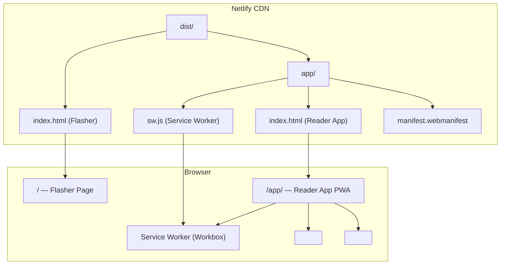
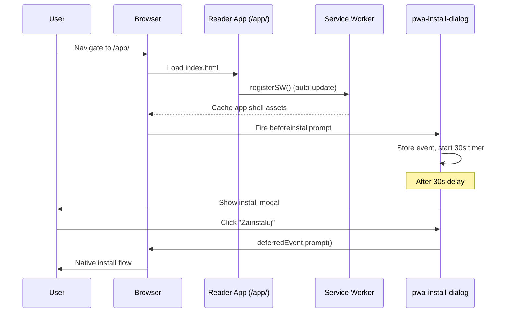
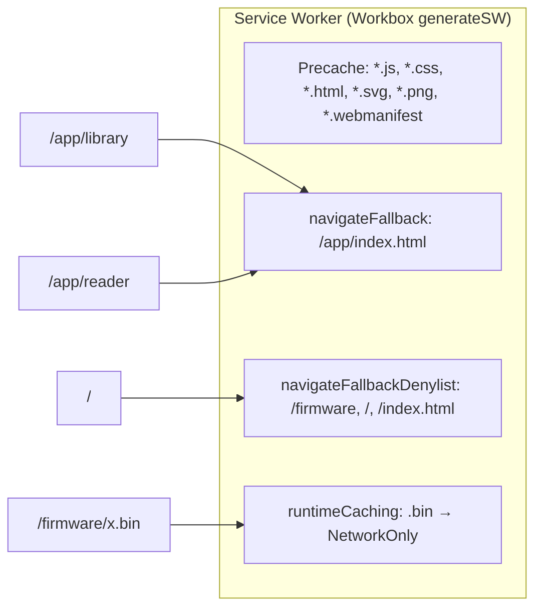

# Design Document: Reader PWA Split

## Overview

Projekt `czytnik01` jest obecnie zbudowany jako multi-page Vite app z dwoma entry pointami (`/` — Flasher, `/app/` — Reader App). Infrastruktura PWA (manifest, Service Worker) jest już skonfigurowana w `vite.config.ts` z użyciem `vite-plugin-pwa`, a plugin `stripPwaFromFlasher` usuwa manifest i SW z Flashera.

Celem tego feature'a jest:

1. Usunięcie niedziałającego komponentu `czytnik-install-prompt` i metody `renderInstallBanner()` / `triggerInstall()`.
2. Zastąpienie go nowym, samodzielnym komponentem `<pwa-install-dialog>` opartym na natywnym `beforeinstallprompt` z 30-sekundowym opóźnieniem, 7-dniowym cooldownem i wsparciem iOS.
3. Integracja promptu instalacyjnego z Onboarding Wizardem (krok 1 = instalacja PWA).
4. Uzupełnienie konfiguracji Netlify o reguły routingu SPA dla `/app/*` i nagłówki cache dla Service Workera.
5. Upewnienie się, że Flasher (`/`) nie zawiera żadnych artefaktów PWA ani logiki połączenia z czytnikiem.

## Architecture





## Components and Interfaces

### Component 1: `<pwa-install-dialog>` (NEW)

**Purpose**: Samodzielny Lit element odpowiedzialny za przechwycenie `beforeinstallprompt`, wyświetlenie modalnego dialogu instalacyjnego po 30s, obsługę iOS fallback i zarządzanie cooldownem 7 dni.

**Interface**:

```typescript
interface BeforeInstallPromptEvent extends Event {
  prompt(): Promise<void>;
  userChoice: Promise<{ outcome: "accepted" | "dismissed" }>;
}

@customElement("pwa-install-dialog")
export class PwaInstallDialog extends LitElement {
  // Reactive state
  @state() private deferredPrompt: BeforeInstallPromptEvent | null;
  @state() private visible: boolean;
  @state() private isIos: boolean;
  @state() private isStandalone: boolean;

  // Public method for programmatic trigger (used by onboarding wizard)
  public triggerInstall(): Promise<"accepted" | "dismissed" | "unavailable">;

  // Public getter for external components to check availability
  public get installAvailable(): boolean;
}
```

**Responsibilities**:

- Nasłuchuje `beforeinstallprompt` i przechowuje event
- Po 30 sekundach od przechwycenia eventu wyświetla modal (jeśli nie w standalone i nie w cooldownie)
- Obsługuje kliknięcie "Zainstaluj" → wywołuje `prompt()` na deferred event
- Obsługuje kliknięcie "Zamknij" → ukrywa modal, zapisuje timestamp w localStorage
- Sprawdza cooldown 7 dni przed ponownym wyświetleniem
- Na iOS wyświetla instrukcje Share Sheet zamiast natywnego promptu
- Nie wyświetla się w trybie standalone (`display-mode: standalone`)
- Emituje custom event `pwa-install-available` gdy prompt jest gotowy (dla onboarding wizarda)

**File**: `src/app/components/pwa-install-dialog.element.ts`

### Component 2: `<onboarding-wizard>` (MODIFIED)

**Purpose**: Pełnoekranowy wizard pierwszego uruchomienia. Modyfikacja: krok 1 (instalacja PWA) staje się inteligentny — korzysta z `<pwa-install-dialog>` API.

**Interface**:

```typescript
@customElement("onboarding-wizard")
export class OnboardingWizard extends LitElement {
  @state() private step: number;
  @state() private dismissed: boolean;
  @state() private installAvailable: boolean;
  @state() private isIos: boolean;
  @state() private isStandalone: boolean;

  // Queries the pwa-install-dialog in the DOM
  private get installDialog(): PwaInstallDialog | null;
}
```

**Responsibilities**:

- Krok 0: Powitanie (bez zmian)
- Krok 1: Instalacja PWA — jeśli `beforeinstallprompt` dostępny → przycisk "Zainstaluj"; jeśli iOS → instrukcje Share Sheet; jeśli ani jedno ani drugie → pomija krok
- Krok 2: Połączenie z urządzeniem (bez zmian)
- Nie wyświetla kroku instalacji gdy app jest w standalone mode
- Zapisuje flagę `flower.onboarded.v1` w localStorage po zakończeniu/pominięciu

### Component 3: `<czytnik-app>` (MODIFIED)

**Purpose**: Główny komponent aplikacji. Modyfikacja: usunięcie `<czytnik-install-prompt>`, `renderInstallBanner()`, `triggerInstall()` i dodanie `<pwa-install-dialog>`.

**Changes**:

```typescript
// REMOVE:
import "./components/install-prompt.element";
// REMOVE: renderInstallBanner() method
// REMOVE: triggerInstall() method
// REMOVE: <czytnik-install-prompt> from render()

// ADD:
import "./components/pwa-install-dialog.element";
// ADD: <pwa-install-dialog> in render() (replaces czytnik-install-prompt)
```

### Component 4: `<czytnik-flasher>` (NO CHANGES)

**Purpose**: Strona flashera. Nie wymaga zmian — już nie zawiera logiki PWA ani połączenia z czytnikiem. Zawiera link do `/app/`.

## Data Models

### localStorage Keys

```typescript
// Cooldown dialogu instalacyjnego (7 dni)
interface InstallDismissData {
  key: "flower.installPrompt.dismissedAt";
  value: string; // ISO timestamp or epoch ms
}

// Flaga onboardingu
interface OnboardingData {
  key: "flower.onboarded.v1";
  value: string; // ISO timestamp
}
```

**Validation Rules**:

- `dismissedAt` musi być parsowalne jako liczba (epoch ms) lub ISO date string
- Jeśli wartość jest nieparsowalna, traktuj jak brak wpisu (pokaż dialog)
- Cooldown = 7 _ 24 _ 60 _ 60 _ 1000 ms

## Key Functions with Formal Specifications

### Function: shouldShowInstallDialog()

```typescript
function shouldShowInstallDialog(
  hasDeferredPrompt: boolean,
  isStandalone: boolean,
  dismissedAt: number | null,
  now: number,
): boolean {
  if (isStandalone) return false;
  if (!hasDeferredPrompt) return false;
  if (dismissedAt && now - dismissedAt < 7 * 24 * 60 * 60 * 1000) return false;
  return true;
}
```

**Preconditions:**

- `now` is a valid epoch timestamp (ms)
- `dismissedAt` is null or a valid epoch timestamp (ms)

**Postconditions:**

- Returns `false` if app is in standalone mode
- Returns `false` if no deferred prompt event is available
- Returns `false` if dismissed less than 7 days ago
- Returns `true` only when all conditions for showing are met

### Function: detectPlatform()

```typescript
type Platform = "android-chrome" | "ios" | "desktop" | "unsupported";

function detectPlatform(): Platform {
  const ua = navigator.userAgent;
  const isIos = /iPad|iPhone|iPod/.test(ua) && !("MSStream" in window);
  const isStandalone =
    window.matchMedia("(display-mode: standalone)").matches ||
    (navigator as any).standalone === true;

  if (isIos) return "ios";
  if ("BeforeInstallPromptEvent" in window || "onbeforeinstallprompt" in window)
    return "android-chrome";
  if (/Chrome|Edge/.test(ua)) return "desktop";
  return "unsupported";
}
```

**Preconditions:**

- Running in a browser environment with `navigator.userAgent` available

**Postconditions:**

- Returns exactly one of the four platform values
- `"ios"` → show Share Sheet instructions
- `"android-chrome"` → use `beforeinstallprompt` API
- `"desktop"` → use `beforeinstallprompt` API (Chrome/Edge desktop)
- `"unsupported"` → skip install prompt entirely

## Vite Build Configuration

### Current State (already correct)

Plik `vite.config.ts` jest już poprawnie skonfigurowany:

```typescript
// Multi-page app z dwoma entry pointami
rollupOptions: {
  input: {
    flasher: resolve(__dirname, "index.html"),
    app: resolve(__dirname, "app/index.html"),
  },
},

// PWA scoped to /app/
VitePWA({
  strategies: "generateSW",
  registerType: "autoUpdate",
  scope: `${repoBase}app/`,
  base: `${repoBase}app/`,
  manifest: {
    start_url: `${repoBase}app/`,
    scope: `${repoBase}app/`,
    // ... icons, colors, etc.
  },
  workbox: {
    navigateFallback: `${repoBase}app/index.html`,
    navigateFallbackDenylist: [/^\/firmware/, /^\/$/, /^\/index\.html$/],
    globPatterns: ["**/*.{js,css,html,svg,png,webmanifest}"],
    runtimeCaching: [
      { urlPattern: ({ url }) => url.pathname.endsWith(".bin"), handler: "NetworkOnly" },
    ],
  },
})

// Plugin usuwający manifest i SW z Flashera
stripPwaFromFlasher()
```

### Changes Required

Jedyna zmiana w `vite.config.ts`: dodanie `injectRegister: "script"` lub upewnienie się, że `injectRegister: false` jest zachowane (rejestracja SW odbywa się ręcznie w `src/app/main.ts` przez `registerSW()`). Obecna konfiguracja jest poprawna — nie wymaga zmian.

## Service Worker Strategy



**Strategy**: `generateSW` z `autoUpdate`

- Precache: Wszystkie assety aplikacji (JS, CSS, HTML, SVG, PNG, webmanifest)
- Navigation fallback: `/app/index.html` dla wszystkich ścieżek pod `/app/*`
- Denylist: Flasher (`/`, `/index.html`) i firmware (`/firmware/*`) nie są obsługiwane przez SW
- Runtime caching: Pliki `.bin` → `NetworkOnly` (nigdy nie cache'owane)
- Auto-update: SW aktualizuje się automatycznie, nowa wersja przejmuje po reloadzie

**Registration** (w `src/app/main.ts`):

```typescript
import { registerSW } from "virtual:pwa-register";

registerSW({
  immediate: true,
  onNeedRefresh() {
    /* SW update ready */
  },
  onOfflineReady() {
    /* app cached for offline */
  },
});
```

## Netlify Deployment Configuration

### Current `netlify.toml`

```toml
[build]
  command = "npx vite build"
  publish = "dist"

[build.environment]
  VITE_BASE = "/"
  NODE_VERSION = "20"
```

### Required Changes

```toml
[build]
  command = "npx vite build"
  publish = "dist"

[build.environment]
  VITE_BASE = "/"
  NODE_VERSION = "20"

# SPA fallback for Reader App — all /app/* routes serve app/index.html
[[redirects]]
  from = "/app/*"
  to = "/app/index.html"
  status = 200
  conditions = {Role = ["admin", "user"]}
  force = false

# Cache-Control for Service Worker — always revalidate
[[headers]]
  for = "/app/sw.js"
  [headers.values]
    Cache-Control = "no-cache"

# Cache-Control for manifest
[[headers]]
  for = "/app/manifest.webmanifest"
  [headers.values]
    Cache-Control = "no-cache"

# Immutable cache for hashed assets
[[headers]]
  for = "/app/assets/*"
  [headers.values]
    Cache-Control = "public, max-age=31536000, immutable"
```

**Routing Logic**:

- `/` → `dist/index.html` (Flasher) — served by default
- `/app/*` → `dist/app/index.html` (SPA fallback for client-side routing)
- `/app/sw.js` → served with `no-cache` header
- Static files (JS, CSS, images) → served directly from `dist/`
- Unknown paths not matching `/app/*` → 404 (Netlify default behavior for missing files)

**Note**: Netlify `[[redirects]]` z `force = false` oznacza, że jeśli plik istnieje fizycznie w `dist/`, zostanie serwowany bezpośrednio. Redirect działa tylko gdy plik nie istnieje — idealne dla SPA fallback.

## File Structure Changes

### Files to DELETE

```
src/app/components/install-prompt.element.ts   ← stary niedziałający komponent
```

### Files to CREATE

```
src/app/components/pwa-install-dialog.element.ts   ← nowy dialog instalacyjny
```

### Files to MODIFY

```
src/app/app.element.ts          ← usunięcie importu install-prompt, renderInstallBanner, triggerInstall
                                   dodanie importu pwa-install-dialog
src/app/components/onboarding.element.ts  ← integracja z pwa-install-dialog API
netlify.toml                    ← dodanie redirects i headers
```

### Files UNCHANGED

```
vite.config.ts                  ← konfiguracja PWA już poprawna
index.html                      ← Flasher entry (bez manifest, bez SW)
app/index.html                  ← Reader App entry (manifest wstrzykiwany przez vite-plugin-pwa)
src/flasher/                    ← bez zmian
src/app/main.ts                 ← rejestracja SW już poprawna
src/shared/config.ts            ← bez zmian
public/icons/                   ← ikony już istnieją (192, 512, maskable-512)
```

## Detailed Component Design: `<pwa-install-dialog>`

```typescript
import { LitElement, css, html, svg } from "lit";
import { customElement, state } from "lit/decorators.js";

interface BeforeInstallPromptEvent extends Event {
  prompt(): Promise<void>;
  userChoice: Promise<{ outcome: "accepted" | "dismissed" }>;
}

const DISMISS_KEY = "flower.installPrompt.dismissedAt";
const DISMISS_TTL_MS = 7 * 24 * 60 * 60 * 1000; // 7 days
const SHOW_DELAY_MS = 30_000; // 30 seconds

@customElement("pwa-install-dialog")
export class PwaInstallDialog extends LitElement {
  @state() private deferredPrompt: BeforeInstallPromptEvent | null = null;
  @state() private visible = false;
  @state() private isIos = false;
  @state() private isStandalone = false;

  private showTimer: ReturnType<typeof setTimeout> | null = null;

  get installAvailable(): boolean {
    return this.deferredPrompt !== null;
  }

  connectedCallback(): void {
    super.connectedCallback();
    this.isStandalone =
      window.matchMedia("(display-mode: standalone)").matches ||
      (navigator as any).standalone === true;
    this.isIos = /iPad|iPhone|iPod/.test(navigator.userAgent) && !("MSStream" in window);

    if (this.isStandalone) return;

    window.addEventListener("beforeinstallprompt", this.handleBeforeInstallPrompt);
    window.addEventListener("appinstalled", this.handleAppInstalled);
  }

  disconnectedCallback(): void {
    super.disconnectedCallback();
    window.removeEventListener("beforeinstallprompt", this.handleBeforeInstallPrompt);
    window.removeEventListener("appinstalled", this.handleAppInstalled);
    if (this.showTimer) clearTimeout(this.showTimer);
  }

  /** Programmatic trigger for onboarding wizard */
  async triggerInstall(): Promise<"accepted" | "dismissed" | "unavailable"> {
    if (!this.deferredPrompt) return "unavailable";
    await this.deferredPrompt.prompt();
    const { outcome } = await this.deferredPrompt.userChoice;
    if (outcome === "accepted") {
      this.deferredPrompt = null;
      this.visible = false;
    }
    return outcome;
  }

  private handleBeforeInstallPrompt = (e: Event) => {
    e.preventDefault();
    this.deferredPrompt = e as BeforeInstallPromptEvent;
    this.dispatchEvent(new CustomEvent("pwa-install-available", { bubbles: true, composed: true }));
    this.scheduleShow();
  };

  private handleAppInstalled = () => {
    this.deferredPrompt = null;
    this.visible = false;
    if (this.showTimer) clearTimeout(this.showTimer);
  };

  private scheduleShow(): void {
    if (this.isStandalone) return;
    if (this.isDismissedRecently()) return;
    this.showTimer = setTimeout(() => {
      this.visible = true;
    }, SHOW_DELAY_MS);
  }

  private isDismissedRecently(): boolean {
    const raw = localStorage.getItem(DISMISS_KEY);
    if (!raw) return false;
    const ts = Number(raw);
    if (isNaN(ts)) return false;
    return Date.now() - ts < DISMISS_TTL_MS;
  }

  private handleInstallClick = async () => {
    const outcome = await this.triggerInstall();
    if (outcome === "dismissed") this.dismiss();
  };

  private dismiss = () => {
    localStorage.setItem(DISMISS_KEY, String(Date.now()));
    this.visible = false;
  };

  render() {
    if (this.isStandalone) return null;
    if (!this.visible) return null;

    return html`
      <div class="backdrop" @click=${this.dismiss}>
        <div class="dialog" @click=${(e: Event) => e.stopPropagation()}>
          <button class="close" @click=${this.dismiss} aria-label="Zamknij">✕</button>
          <div class="icon">${this.flowerIcon()}</div>
          <h2>Flower</h2>
          ${this.isIos ? this.renderIosInstructions() : this.renderChromePrompt()}
        </div>
      </div>
    `;
  }

  private renderChromePrompt() {
    return html`
      <p>Czy chcesz pobrać aplikację Flower na swoje urządzenie?</p>
      <button class="cta" @click=${this.handleInstallClick}>Zainstaluj</button>
    `;
  }

  private renderIosInstructions() {
    return html`
      <p>Aby zainstalować aplikację na iOS:</p>
      <ol>
        <li>Naciśnij ikonę <strong>Udostępnij</strong> (kwadrat ze strzałką na dole ekranu)</li>
        <li>Przewiń w dół i wybierz <strong>„Dodaj do ekranu początkowego"</strong></li>
        <li>Potwierdź przyciskiem <strong>„Dodaj"</strong></li>
      </ol>
    `;
  }

  private flowerIcon() {
    /* SVG flower icon */
  }

  static styles = css`
    /* modal styles with backdrop, animation */
  `;
}
```

## Detailed Onboarding Wizard Changes

### Step 1 (Install PWA) — New Logic

```typescript
// In onboarding.element.ts, step 1 becomes:
private renderInstallStep() {
  // Skip entirely if standalone
  if (this.isStandalone) return this.renderStep2(); // jump to connect step

  const isIos = /iPad|iPhone|iPod/.test(navigator.userAgent)
    && !("MSStream" in window);

  if (isIos) {
    return html`
      <div class="hero soft">${this.iconAdd()}</div>
      <h2>Dodaj do ekranu głównego</h2>
      <ol class="ios-steps">
        <li>Naciśnij ikonę <strong>Udostępnij</strong> (kwadrat ze strzałką)</li>
        <li>Wybierz <strong>„Dodaj do ekranu początkowego"</strong></li>
      </ol>
    `;
  }

  // Check if beforeinstallprompt is available via pwa-install-dialog
  const dialog = document.querySelector("pwa-install-dialog") as PwaInstallDialog | null;
  if (!dialog?.installAvailable) {
    // Skip install step — no prompt available and not iOS
    return null; // wizard will skip this step
  }

  return html`
    <div class="hero soft">${this.iconAdd()}</div>
    <h2>Zainstaluj aplikację</h2>
    <p>Dodaj Flower do ekranu głównego — będzie działać jak natywna aplikacja.</p>
    <button class="cta" @click=${this.handleOnboardingInstall}>Zainstaluj</button>
  `;
}

private handleOnboardingInstall = async () => {
  const dialog = document.querySelector("pwa-install-dialog") as PwaInstallDialog | null;
  if (!dialog) return;
  const outcome = await dialog.triggerInstall();
  // Regardless of outcome, proceed to next step
  this.step += 1;
};
```

## Correctness Properties

### Property 1: Standalone suppression

∀ state where `isStandalone = true` → `<pwa-install-dialog>` NEVER renders any visible content AND onboarding wizard NEVER shows the install step.

**Validates: Requirements 3.4, 7.7**

### Property 2: Cooldown enforcement

∀ dismiss timestamp `t` where `Date.now() - t < 7 * 24 * 60 * 60 * 1000` → dialog SHALL NOT be shown, regardless of `beforeinstallprompt` availability.

**Validates: Requirements 3.3, 3.6**

### Property 3: Delay guarantee

∀ `beforeinstallprompt` event received at time `t₀` → dialog becomes visible no earlier than `t₀ + 30000ms`.

**Validates: Requirements 3.1**

### Property 4: Flasher isolation

The built `dist/index.html` (Flasher) SHALL NOT contain any `<link rel="manifest">` tag, any `<script>` referencing service worker registration, or any import of PWA-related modules.

**Validates: Requirements 2.2**

### Property 5: SPA routing

∀ path `p` matching `/app/*` that does not correspond to a physical file in `dist/app/` → Netlify serves `dist/app/index.html` with HTTP 200.

**Validates: Requirements 6.4**

### Property 6: SW scope containment

The Service Worker's `scope` is `/app/` → it SHALL NOT intercept fetch events for paths outside `/app/` (e.g., `/`, `/firmware/*`).

**Validates: Requirements 1.2, 2.2**

### Property 7: Install prompt single-fire

After `deferredPrompt.prompt()` is called once, the `deferredPrompt` reference is nullified → subsequent calls to `triggerInstall()` return `"unavailable"`.

**Validates: Requirements 3.2**

### Property 8: Old component removal

After implementation, the source tree SHALL NOT contain any file named `install-prompt.element.ts`, any import referencing that module, any `<czytnik-install-prompt>` tag, or any `triggerInstall()` method that queries that element.

**Validates: Requirements 4.1, 4.2, 4.3, 4.4**

## Error Handling

### Error Scenario 1: `beforeinstallprompt` never fires

**Condition**: Browser doesn't support PWA install (Firefox, Safari desktop) or app is already installed
**Response**: `<pwa-install-dialog>` remains invisible; onboarding wizard skips install step
**Recovery**: App functions normally as standard web app

### Error Scenario 2: User dismisses native install prompt

**Condition**: User clicks "Cancel" in browser's native install dialog
**Response**: `userChoice` resolves with `"dismissed"`; dialog hides; cooldown timestamp saved
**Recovery**: Dialog can reappear after 7 days

### Error Scenario 3: Service Worker registration fails

**Condition**: Browser doesn't support SW, or HTTPS not available
**Response**: `registerSW()` silently fails; app works without offline support
**Recovery**: App functions as standard web page; no install prompt shown

### Error Scenario 4: localStorage unavailable

**Condition**: Private browsing mode or storage quota exceeded
**Response**: Cooldown check returns `false` (no stored timestamp); onboarding flag not persisted
**Recovery**: Dialog may show on every visit; onboarding may repeat — acceptable degradation

## Testing Strategy

### Unit Testing Approach

- Test `shouldShowInstallDialog()` pure function with various input combinations
- Test `detectPlatform()` with mocked user agents
- Test localStorage cooldown logic (expired, valid, missing, corrupted)
- Test onboarding wizard step skipping logic

### Integration Testing Approach

- Manual test on Android Chrome: verify `beforeinstallprompt` fires, dialog appears after 30s, install works
- Manual test on iOS Safari: verify Share Sheet instructions appear
- Manual test in standalone mode: verify no dialog or install step shown
- Verify Flasher page has no `<link rel="manifest">` and no SW registration
- Verify `/app/library` deep link works via Netlify redirect

### Property-Based Testing Approach

**Property Test Library**: N/A (component is primarily UI-driven; logic is simple enough for unit tests)

Key properties to verify:

- ∀ timestamp t: `isDismissedRecently(t)` ↔ `Date.now() - t < 7 days`
- ∀ state: `isStandalone = true` → dialog never renders
- ∀ state: `deferredPrompt = null ∧ !isIos` → dialog never renders

## Performance Considerations

- Service Worker precaches all app assets → first load caches ~2-5 MB, subsequent loads instant from cache
- 30-second delay before showing install dialog prevents layout shift on initial load
- `navigateFallbackDenylist` ensures Flasher and firmware paths are never intercepted by SW
- Hashed assets (`/app/assets/*`) served with immutable cache headers → no revalidation needed

## Security Considerations

- Service Worker only operates within `/app/` scope — cannot intercept Flasher or firmware requests
- `beforeinstallprompt` event is only available on HTTPS origins (enforced by browser)
- localStorage keys use app-specific prefix (`flower.`) to avoid collisions
- No sensitive data stored in localStorage (only timestamps and boolean flags)

## Dependencies

- **lit** `^3.2.0` — Web Components framework (existing)
- **vite-plugin-pwa** `^0.20.5` — PWA manifest + SW generation (existing)
- **workbox-window** `^7.1.0` — SW registration helper (existing)
- **esp-web-tools** `^10.1.0` — Flasher component (existing, Flasher only)

No new dependencies required.
