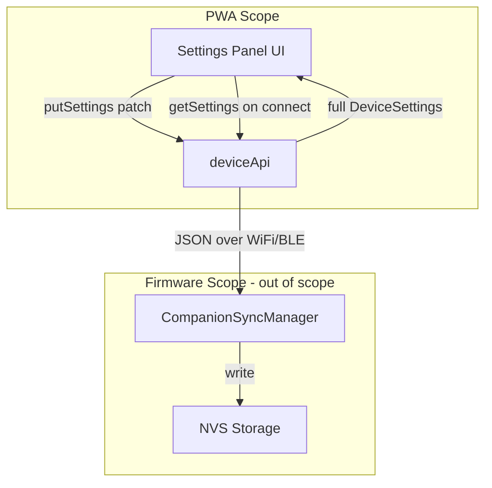

# Design Document: Scroll Mode Settings

## Overview

This feature extends the Flower PWA settings panel to support mode-contextual settings. The reading mode selector (`readerMode`) is promoted to the top of the panel as the primary control. Based on the selected mode, the panel conditionally renders either RSVP-specific or scroll-specific settings controls.

The PWA is responsible for:

- Rendering the correct UI controls based on the active reading mode
- Sending new scroll setting values to the device via `deviceApi.putSettings()`
- Displaying human-readable labels for each setting level
- Handling sync errors with optimistic UI revert

The firmware side (NVS storage, pixel mapping, rendering) is out of scope for this design.

### Design Decisions

1. **Flat DeviceSettings interface** — New scroll fields are added directly to the existing `DeviceSettings` interface rather than nesting them in a sub-object. This matches the existing pattern and keeps `putSettings(patch)` simple (partial flat object).

2. **Segmented controls for discrete levels** — Font size (5 levels), line spacing (3 levels), and margins (3 levels) use the existing `this.segmented()` helper, which already renders pill-button groups. No new UI component is needed.

3. **Optimistic UI updates** — The existing `put()` method already does optimistic updates (mutate local state → await sync → revert on error). No change needed to the update pattern.

4. **Numeric enum values as setting type** — Settings are stored as numbers (0–4 for font size, 0–2 for spacing/margin) matching the NVS uint8_t format. The PWA maps these to human-readable labels purely in the view layer.

## Architecture



The data flow is unchanged — only the shape of `DeviceSettings` and the rendered UI are modified.

## Components and Interfaces

### Modified: `DeviceSettings` interface (`src/app/device/api.ts`)

```typescript
export interface DeviceSettings {
  // ... existing fields unchanged ...

  // New scroll mode fields
  scrollFontSize: number; // 0–4 (Extra Small → Extra Large)
  scrollLineSpacing: number; // 0–2 (Compact → Relaxed)
  scrollMargin: number; // 0–2 (Narrow → Wide)
}
```

### Modified: `DEFAULT_SETTINGS` (`src/app/device/api.ts`)

```typescript
export const DEFAULT_SETTINGS: DeviceSettings = {
  // ... existing defaults unchanged ...
  scrollFontSize: 2, // Medium
  scrollLineSpacing: 1, // Normal
  scrollMargin: 1, // Normal
};
```

### Modified: `SettingsPanel` component (`src/app/components/settings-panel.element.ts`)

**New label maps:**

```typescript
const FONT_SIZE_LABEL: Record<number, string> = {
  0: "Extra Small",
  1: "Small",
  2: "Medium",
  3: "Large",
  4: "Extra Large",
};

const LINE_SPACING_LABEL: Record<number, string> = {
  0: "Compact",
  1: "Normal",
  2: "Relaxed",
};

const MARGIN_LABEL: Record<number, string> = {
  0: "Narrow",
  1: "Normal",
  2: "Wide",
};
```

**Restructured `render()` method layout:**

```
1. Brand header (unchanged)
2. Error display (unchanged)
3. NEW: "Tryb czytania" fieldset — readerMode segmented control (own section)
4. CONDITIONAL:
   - If readerMode === "rsvp": "Ustawienia RSVP" fieldset (pauseBehaviour, baseWpm, delays)
   - If readerMode === "scroll": "Ustawienia Scroll" fieldset (scrollFontSize, scrollLineSpacing, scrollMargin)
5. "Wyświetlanie" fieldset — theme, brightness, readerHand (readerMode removed from here)
6. "HUD" fieldset (unchanged)
7. "Język" fieldset (unchanged)
8. Developer fieldset (unchanged)
```

**Scroll settings controls use `segmented()` helper:**

```typescript
// Inside the scroll fieldset:
this.segmented(
  "scrollFontSize",
  s.scrollFontSize,
  [0, 1, 2, 3, 4],
  FONT_SIZE_LABEL,
  "Rozmiar czcionki",
);
this.segmented(
  "scrollLineSpacing",
  s.scrollLineSpacing,
  [0, 1, 2],
  LINE_SPACING_LABEL,
  "Interlinia",
);
this.segmented("scrollMargin", s.scrollMargin, [0, 1, 2], MARGIN_LABEL, "Marginesy");
```

### Invalid Mode Handling

If `settings.readerMode` is not `"rsvp"` and not `"scroll"`, the panel treats it as `"rsvp"` (default). This is implemented with a simple check:

```typescript
private get effectiveMode(): ReaderMode {
  const m = this.settings?.readerMode;
  return m === "scroll" ? "scroll" : "rsvp";
}
```

## Data Models

### Settings Value Ranges

| Field               | Type     | Min | Max | Default | NVS Key            |
| ------------------- | -------- | --- | --- | ------- | ------------------ |
| `scrollFontSize`    | `number` | 0   | 4   | 2       | `scroll_font_size` |
| `scrollLineSpacing` | `number` | 0   | 2   | 1       | `scroll_line_sp`   |
| `scrollMargin`      | `number` | 0   | 2   | 1       | `scroll_margin`    |

### Label Mappings

| Value | Font Size Label | Line Spacing Label | Margin Label |
| ----- | --------------- | ------------------ | ------------ |
| 0     | Extra Small     | Compact            | Narrow       |
| 1     | Small           | Normal             | Normal       |
| 2     | Medium          | Relaxed            | Wide         |
| 3     | Large           | —                  | —            |
| 4     | Extra Large     | —                  | —            |

### putSettings Patch Examples

Mode switch:

```json
{ "readerMode": "scroll" }
```

Scroll font size change:

```json
{ "scrollFontSize": 3 }
```

Multiple scroll settings (not typical, but supported):

```json
{ "scrollFontSize": 4, "scrollLineSpacing": 2 }
```

## Correctness Properties

_A property is a characteristic or behavior that should hold true across all valid executions of a system — essentially, a formal statement about what the system should do. Properties serve as the bridge between human-readable specifications and machine-verifiable correctness guarantees._

### Property 1: Mode-contextual control visibility

_For any_ valid `DeviceSettings` object, when the settings panel renders with `readerMode === "scroll"`, the DOM SHALL contain scroll setting controls (scrollFontSize, scrollLineSpacing, scrollMargin) and SHALL NOT contain RSVP-specific controls (pauseBehaviour, baseWpm, longWordDelayMs, complexWordDelayMs, punctuationDelayMs); and conversely, when `readerMode === "rsvp"`, the DOM SHALL contain RSVP controls and SHALL NOT contain scroll controls.

**Validates: Requirements 2.1, 2.2, 2.3, 2.4**

### Property 2: Setting change isolation

_For any_ user interaction that changes a scroll-mode setting (scrollFontSize, scrollLineSpacing, scrollMargin), the `putSettings` patch SHALL contain only the changed scroll field and SHALL NOT include any RSVP-specific keys (pauseBehaviour, baseWpm, longWordDelayMs, complexWordDelayMs, punctuationDelayMs); and conversely, for any RSVP setting change, the patch SHALL NOT include scroll-specific keys.

**Validates: Requirements 3.5, 3.6**

### Property 3: Scroll setting sync correctness

_For any_ scroll setting field (scrollFontSize with values 0–4, scrollLineSpacing with values 0–2, scrollMargin with values 0–2), when the user selects a valid level, `putSettings` SHALL be called with a patch containing exactly that field mapped to the selected numeric value.

**Validates: Requirements 4.2, 5.2, 6.2**

### Property 4: Error recovery preserves previous state

_For any_ DeviceSettings state and any setting change where `putSettings` rejects with an error, the component's settings state SHALL revert to the pre-change values and an error message SHALL be displayed.

**Validates: Requirements 7.6**

### Property 5: Label correctness for scroll settings

_For any_ scrollFontSize value in 0–4, scrollLineSpacing value in 0–2, and scrollMargin value in 0–2, the rendered settings panel SHALL display the corresponding human-readable label text from the defined label mapping (FONT_SIZE_LABEL, LINE_SPACING_LABEL, MARGIN_LABEL).

**Validates: Requirements 8.1, 8.3, 8.5**

## Error Handling

| Scenario                                                   | Behavior                                                                                                  |
| ---------------------------------------------------------- | --------------------------------------------------------------------------------------------------------- |
| `putSettings` rejects (network error, device disconnected) | Optimistic UI reverts to previous state; error message displayed in `.error` element                      |
| `getSettings` fails on connect                             | Error message shown; settings panel displays loading state                                                |
| `readerMode` has unexpected value (not "rsvp" / "scroll")  | Treated as "rsvp" — RSVP controls shown (defensive default)                                               |
| Scroll setting value out of range received from device     | UI renders whatever value is returned; firmware is responsible for clamping. PWA trusts the device state. |

The error handling pattern is already implemented in the `put()` method (optimistic update → revert on catch). No new error handling logic is needed.

## Testing Strategy

### Unit Tests (Example-based)

1. **Layout ordering** — Verify the reading mode selector is the first fieldset after brand header
2. **Separate section** — Verify readerMode is in its own fieldset, not grouped with other settings
3. **Control count** — Verify font size has 5 buttons, line spacing has 3, margin has 3
4. **Invalid mode fallback** — Verify unknown readerMode values render RSVP controls
5. **Optimistic update timing** — Verify label updates before putSettings resolves

### Property-Based Tests (fast-check)

Property-based testing is appropriate here because:

- The settings panel's conditional rendering logic depends on variable input (DeviceSettings values)
- Setting isolation can be verified across all combinations of settings
- Label correctness must hold for all valid enum values

**Library:** [fast-check](https://github.com/dubzzz/fast-check) (TypeScript PBT library, already in the JS/TS ecosystem)

**Configuration:**

- Minimum 100 iterations per property
- Each test tagged with: `Feature: scroll-mode-settings, Property {N}: {title}`

**Properties to implement:**

1. Mode-contextual control visibility (Property 1)
2. Setting change isolation (Property 2)
3. Scroll setting sync correctness (Property 3)
4. Error recovery preserves previous state (Property 4)
5. Label correctness for scroll settings (Property 5)

### Integration Tests

- Verify `MockDeviceApi` correctly stores and retrieves new scroll fields
- Verify full round-trip: change setting → putSettings → getSettings → verify stored value
