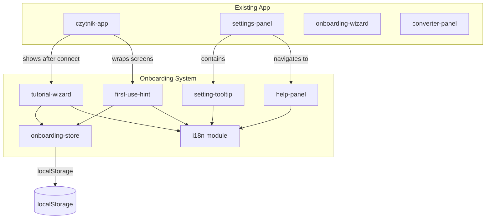
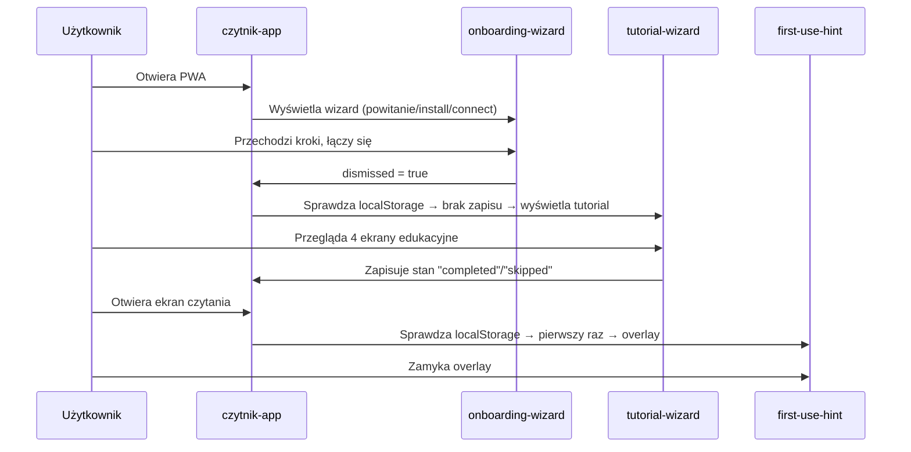

# Design Document: User Onboarding

## Overview

System onboardingu dla aplikacji PWA czytnika Flower — zestaw komponentów edukacyjnych, które pomagają nowemu użytkownikowi zrozumieć funkcje urządzenia. Obejmuje: interaktywny tutorial powitalny (4 ekrany edukacyjne), tooltips kontekstowe w panelu ustawień, pełną stronę pomocy oraz overlaye z wskazówkami przy pierwszym użyciu ekranów.

System jest zbudowany jako zestaw Lit Web Components, przechowuje stan w localStorage (osobne klucze per funkcja), korzysta z systemu motywów aplikacji i obsługuje 6 języków za pośrednictwem nowego modułu i18n.

### Kluczowe decyzje projektowe

1. **Rozszerzenie istniejącego `onboarding-wizard`** — obecny komponent obsługuje powitanie/instalację/połączenie. Nowy tutorial edukacyjny zostaje osobnym komponentem `tutorial-wizard`, uruchamianym po pierwszym połączeniu z urządzeniem (nie po otwarciu PWA).
2. **Moduł i18n** — aplikacja nie ma jeszcze systemu tłumaczeń. Wprowadzamy lekki moduł `src/app/i18n/` z plikami JSON per język i reaktywnym API opartym na zdarzeniach.
3. **Tooltip jako osobny komponent** — `<setting-tooltip>` renderowany wewnątrz `settings-panel`, zarządzany wzorcem singleton (max 1 widoczny).
4. **Help page jako nowy panel** — `<help-panel>` dodany do systemu nawigacji w `settings` view.
5. **First-use overlaye** — generyczny komponent `<first-use-hint>` z atrybutem `screen-key` do identyfikacji ekranu.

## Architecture



### Przepływ użytkownika



## Components and Interfaces

### 1. `onboarding-store` — moduł stanu onboardingu

```typescript
// src/app/onboarding/onboarding-store.ts

const PREFIX = "flower.onboarding.";

export type TutorialStatus = "not_seen" | "completed" | "skipped";

export interface OnboardingState {
  tutorialStatus: TutorialStatus;
  tutorialCompletedAt: string | null;
  hintsSeen: Record<string, boolean>; // key = screen identifier
}

export function getTutorialStatus(): TutorialStatus;
export function setTutorialStatus(status: "completed" | "skipped"): void;
export function resetTutorial(): void;
export function isHintSeen(screenKey: string): boolean;
export function markHintSeen(screenKey: string): void;
export function isLocalStorageAvailable(): boolean;
```

**Klucze localStorage:**

- `flower.onboarding.tutorial` — `"completed"` | `"skipped"` | brak
- `flower.onboarding.tutorial.completedAt` — ISO timestamp
- `flower.onboarding.hint.<screenKey>` — `"1"` per ekran

**Zasada bezpieczeństwa:** Wszystkie odczyty opakowane w try/catch. Uszkodzone wartości traktowane jak brak zapisu (tutorial się wyświetli). Brak dostępu do localStorage → hint NIE wyświetla się (zgodnie z wymaganiem 6.5).

### 2. `tutorial-wizard` — komponent tutorialu edukacyjnego

```typescript
// src/app/components/tutorial-wizard.element.ts

@customElement("tutorial-wizard")
export class TutorialWizard extends LitElement {
  @state() private step: number = 0; // 0..3 (4 ekrany)
  @state() private dismissed: boolean = false;

  // Ekrany: RSVP, Tempo WPM, Pauza, HUD
  private readonly screens: TutorialScreen[] = [...];

  // Nawigacja: Dalej/Wstecz + swipe gestures
  // Przycisk "Pomiń" na każdym ekranie
  // Wskaźnik postępu "krok X z 4"
  // Na ostatnim ekranie: "Zakończ" zamiast "Dalej"
}

interface TutorialScreen {
  titleKey: string;     // klucz i18n
  descKey: string;      // klucz i18n
  visual: () => TemplateResult; // SVG/ikona
}
```

**Gesty swipe:** `touchstart`/`touchend` z progiem 50px. Na pierwszym ekranie swipe-right zablokowany, przycisk Wstecz ukryty.

### 3. `setting-tooltip` — tooltip kontekstowy

```typescript
// src/app/components/setting-tooltip.element.ts

@customElement("setting-tooltip")
export class SettingTooltip extends LitElement {
  @property() settingKey: string = "";
  @state() private visible: boolean = false;

  // Renderuje ikonę "?" — po kliknięciu wyświetla popup
  // Max 200 znaków, zawiera: opis, efekt zmiany, domyślną wartość
  // Tylko 1 tooltip widoczny na raz (managed via event bus)
}
```

**Wzorzec singleton:** Zdarzenie `tooltip-open` na `document` — każdy tooltip nasłuchuje i zamyka się gdy otwiera się inny.

### 4. `help-panel` — strona pomocy

```typescript
// src/app/components/help-panel.element.ts

@customElement("help-panel")
export class HelpPanel extends LitElement {
  @state() private expandedItem: string | null = null; // per kategoria max 1

  // Sekcja "Szybki start" na górze
  // Kategorie: Wyświetlanie, Czytanie, HUD, Język, Połączenie
  // Accordion: rozwinięcie jednego elementu zwija poprzedni w kategorii
  // Przycisk "Uruchom tutorial ponownie"
  // Przycisk powrotu do settings
  // Działa offline (statyczne dane w bundlu)
}
```

### 5. `first-use-hint` — overlay wskazówki

```typescript
// src/app/components/first-use-hint.element.ts

@customElement("first-use-hint")
export class FirstUseHint extends LitElement {
  @property() screenKey: string = ""; // "reading" | "converter"
  @state() private visible: boolean = false;

  // Sprawdza onboarding-store przy connectedCallback
  // Overlay blokuje interakcję (pointer-events na tle)
  // Przycisk zamknięcia min 44×44px
  // Max 150 znaków tekstu
  // Po zamknięciu: odblokowanie w ≤300ms
}
```

### 6. `i18n` — moduł tłumaczeń

```typescript
// src/app/i18n/index.ts

export type SupportedLang = "en" | "es" | "fr" | "de" | "ro" | "pl";

export function t(key: string): string;
export function setLang(lang: SupportedLang): void;
export function getLang(): SupportedLang;
export function onLangChange(cb: () => void): () => void;
```

**Struktura plików tłumaczeń:**

```
src/app/i18n/
  index.ts          — API modułu
  locales/
    en.json
    es.json
    fr.json
    de.json
    ro.json
    pl.json
```

Każdy plik JSON ma płaską strukturę kluczy z namespace prefixem:

```json
{
  "tutorial.rsvp.title": "RSVP",
  "tutorial.rsvp.desc": "Wyświetlanie słowo po słowie...",
  "tooltip.baseWpm.desc": "Bazowa prędkość czytania...",
  "help.category.display": "Wyświetlanie",
  "hint.reading.text": "Dotknij aby zapauzować..."
}
```

**Fallback:** Brak klucza w wybranym języku → angielski. Brak w angielskim → klucz jako tekst.

**Reaktywność:** `setLang()` emituje zdarzenie `lang-changed` na `document`. Komponenty nasłuchują i re-renderują (Lit reactive controller lub `requestUpdate()`).

**Mapowanie języka urządzenia → i18n:**

- Firmware przechowuje `ui_lang` jako index 0–5
- Aplikacja mapuje: 0=en, 1=es, 2=fr, 3=de, 4=ro, 5=pl
- Zmiana w `settings-panel` → `setLang()` → komponenty onboardingu aktualizują treść ≤500ms

## Data Models

### localStorage schema

| Klucz                                    | Typ                          | Opis                               |
| ---------------------------------------- | ---------------------------- | ---------------------------------- |
| `flower.onboarding.tutorial`             | `"completed"` \| `"skipped"` | Stan tutorialu                     |
| `flower.onboarding.tutorial.completedAt` | ISO string                   | Timestamp ukończenia               |
| `flower.onboarding.hint.reading`         | `"1"`                        | Wskazówka ekranu czytania widziana |
| `flower.onboarding.hint.converter`       | `"1"`                        | Wskazówka konwertera widziana      |
| `flower.onboarded.v1`                    | ISO string                   | Istniejący klucz starego wizarda   |

### Tooltip data model

```typescript
interface TooltipData {
  settingKey: string; // np. "baseWpm"
  descriptionKey: string; // klucz i18n np. "tooltip.baseWpm.desc"
  effectKey: string; // klucz i18n np. "tooltip.baseWpm.effect"
  defaultValue: string; // np. "300 WPM"
}
```

### Help page data model

```typescript
interface HelpCategory {
  titleKey: string;
  items: HelpItem[];
}

interface HelpItem {
  nameKey: string;
  descKey: string;
  valuesKey: string; // dostępne wartości/zakres
}
```

### Tutorial screen data model

```typescript
interface TutorialScreenData {
  id: string; // "rsvp" | "wpm" | "pause" | "hud"
  titleKey: string; // klucz i18n
  descKey: string; // klucz i18n
  visualType: "rsvp-demo" | "wpm-range" | "pause-modes" | "hud-elements";
}
```

## Correctness Properties

_A property is a characteristic or behavior that should hold true across all valid executions of a system — essentially, a formal statement about what the system should do. Properties serve as the bridge between human-readable specifications and machine-verifiable correctness guarantees._

### Property 1: Tutorial state classification

_For any_ string value stored in the `flower.onboarding.tutorial` localStorage key (including valid values "completed"/"skipped", empty string, corrupted/random data, or absence of key), `getTutorialStatus()` SHALL return exactly one of: `"completed"` if value is "completed", `"skipped"` if value is "skipped", or `"not_seen"` for any other value including missing/corrupt data.

**Validates: Requirements 1.1, 1.8**

### Property 2: Tutorial state persistence round-trip

_For any_ valid tutorial status transition (complete or skip), writing the status via `setTutorialStatus()` and then reading it via `getTutorialStatus()` SHALL return the written status. Additionally, _for any_ previous state, calling `resetTutorial()` followed by `getTutorialStatus()` SHALL return `"not_seen"`.

**Validates: Requirements 1.4, 1.7, 5.2, 5.3**

### Property 3: Tutorial navigation state machine

_For any_ current step index in [0, totalSteps-1], advancing (next) SHALL produce step+1 when step < totalSteps-1, and going back SHALL produce step-1 when step > 0. At step 0, back is a no-op (stays at 0). At the last step, the action is "finish" (not advance). The progress indicator SHALL always equal "krok {step+1} z {totalSteps}".

**Validates: Requirements 1.3, 1.6, 2.7, 2.8, 2.9**

### Property 4: Tutorial content length constraints

_For any_ supported language and _for any_ tutorial screen, the description text SHALL contain at most 2 sentences, and each sentence SHALL be at most 120 characters long.

**Validates: Requirements 2.1**

### Property 5: Tooltip data completeness and constraints

_For any_ setting key listed in the specified categories (Czytanie, Typografia, Wyświetlanie — total of 26+ settings), tooltip data SHALL exist containing a non-empty description, a non-empty effect text, and a default value. The combined tooltip text SHALL not exceed 200 characters.

**Validates: Requirements 3.2, 3.3, 3.5**

### Property 6: Help page accordion invariant

_For any_ help category and _for any_ sequence of item expansions within that category, at most 1 item SHALL be in expanded state at any point in time.

**Validates: Requirements 4.7**

### Property 7: Hint visibility decision

_For any_ screen key, if the key has NOT been marked as seen in localStorage, `isHintSeen(key)` SHALL return `false` (hint should show). If the key HAS been marked as seen, `isHintSeen(key)` SHALL return `true` (hint should not show). If localStorage is unavailable, the function SHALL return `true` (don't show hint, don't block functionality).

**Validates: Requirements 6.1, 6.2, 6.5**

### Property 8: Hint key isolation

_For any_ two distinct screen keys A and B, calling `markHintSeen(A)` SHALL NOT affect the return value of `isHintSeen(B)`. Each screen key operates on an independent localStorage entry.

**Validates: Requirements 6.3**

### Property 9: i18n completeness and fallback

_For any_ onboarding translation key used by the system and _for any_ of the 6 supported languages, calling `t(key)` SHALL return a non-empty string. If the key is missing in the active locale, it SHALL fall back to the English translation. If also missing in English, it SHALL return the key itself.

**Validates: Requirements 7.1, 7.2, 7.4**

## Error Handling

### localStorage failures

| Scenario                                                    | Behavior                                                                                              |
| ----------------------------------------------------------- | ----------------------------------------------------------------------------------------------------- |
| localStorage unavailable (private browsing, quota exceeded) | Tutorial: treat as "not_seen" → show tutorial. Hints: treat as "seen" → DON'T show hint, don't block. |
| Corrupted value in tutorial key                             | Treat as "not_seen" → show tutorial                                                                   |
| Write failure after tutorial completion                     | Silently fail; tutorial may show again next time                                                      |
| Write failure after hint dismiss                            | Silently fail; hint may show again next time                                                          |

### i18n failures

| Scenario                                 | Behavior                                            |
| ---------------------------------------- | --------------------------------------------------- |
| Missing translation key in active locale | Fallback to English                                 |
| Missing translation key in English       | Return key string as-is                             |
| Locale file fails to load                | Fall back to English bundle (always bundled inline) |
| Invalid language code                    | Default to Polish (current app default)             |

### Component errors

| Scenario                          | Behavior                                   |
| --------------------------------- | ------------------------------------------ |
| Tutorial wizard fails to render   | Dismiss tutorial silently, don't block app |
| Tooltip content exceeds 200 chars | Truncate with "…" at 197 chars             |
| Help panel data missing category  | Skip category, render available ones       |
| Swipe gesture detection fails     | Buttons remain functional as fallback      |

## Testing Strategy

### Property-Based Tests (fast-check)

Biblioteka: **fast-check** (TypeScript property-based testing library)
Konfiguracja: minimum 100 iteracji per test.

Testy property-based pokrywają Properties 1–9 z sekcji Correctness Properties:

1. **Onboarding store logic** — Properties 1, 2, 7, 8
   - Generatory: losowe stringi dla localStorage values, losowe screen keys
   - Testują czystą logikę `onboarding-store.ts` bez DOM

2. **Tutorial navigation** — Property 3
   - Generatory: losowe sekwencje akcji [next, back, skip] i losowe startowe step values
   - Testują state machine logic

3. **Content validation** — Properties 4, 5
   - Generatory: iteracja po wszystkich językach × ekranach/ustawieniach
   - Testują spełnienie constraintów na danych statycznych

4. **Accordion logic** — Property 6
   - Generatory: losowe sekwencje toggle actions na losowych elementach
   - Testują stan help-panel

5. **i18n module** — Property 9
   - Generatory: losowe klucze z zestawu onboarding keys × losowe języki
   - Testują fallback logic

Tag format: `Feature: user-onboarding, Property {N}: {title}`

### Unit Tests (Vitest)

Testy example-based dla:

- Konkretna kolejność ekranów tutorialu (2.2)
- Tooltip singleton behavior (3.6, 3.7)
- Help page "Quick start" section rendering (4.4)
- Close button size ≥ 44×44px (6.4)
- Theme CSS variable usage (8.3)
- Animation duration ≤ 200ms (8.4)
- Font size ≥ 16px (8.2)

### Integration Tests

- Offline help page rendering (4.5)
- No device commands during onboarding (8.1)
- Language change triggers re-render across all visible onboarding components (7.3)
- Full tutorial flow: open → navigate → complete → verify localStorage state
